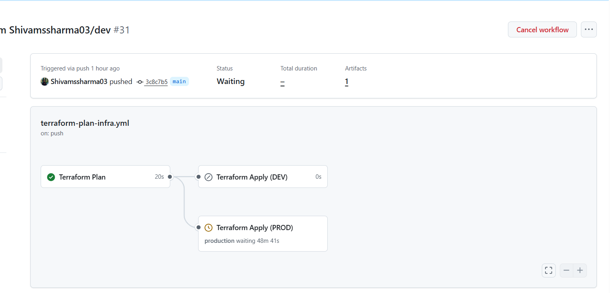
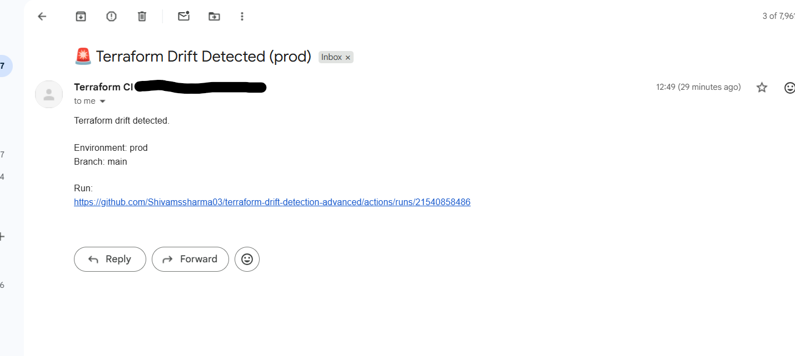

# Terraform CI/CD & Drift Detection

This repository contains two production-grade Terraform pipelines implemented using GitHub Actions:

1. Terraform Apply Pipeline – applies infrastructure only after manual approval  
2. Terraform Drift Detection Pipeline – detects infrastructure drift, fails the pipeline, and sends alerts

Both pipelines follow real-world DevOps best practices:
- No AWS access keys stored in GitHub
- Secure authentication using AWS OIDC
- Environment-based isolation (dev & prod)
- Encrypted remote Terraform backend
- State locking enabled
- Automated drift detection

---

## Repository Structure

infra/
└── environment/
    ├── dev/
    │   ├── backend.tf
    │   ├── provider.tf
    │   ├── variables.tf
    │   ├── terraform.tfvars
    │   └── main.tf
    └── prod/
        ├── backend.tf
        ├── provider.tf
        ├── variables.tf
        ├── terraform.tfvars
        └── main.tf

modules/
├── ec2/
└── s3/

.github/
└── workflows/
    ├── terraform-apply.yml
    └── terraform-drift-detection.yml

---

## Terraform Apply Pipeline (Infrastructure Deployment)

### Purpose
Safely deploy infrastructure using Terraform with branch-based environment selection and manual approval for production.

### Trigger Conditions
- Triggered only when changes occur under:
  infra/**
- Branch-based behavior:

| Git Branch | Environment | Terraform Directory |
|-----------|------------|---------------------|
| dev | Development | infra/environment/dev |
| main | Production | infra/environment/prod |

### Apply Pipeline Flow
1. Checkout repository
2. Setup Terraform
3. Detect environment based on branch
4. Terraform fmt
5. Terraform init
6. Terraform validate
7. Terraform plan
8. Manual approval (production only)
9. Terraform apply

### Production Approval (GitHub Environments)
Production deployments are protected using GitHub Environments.

- Workflow uses:
  environment: production
- The production environment is configured with:
  - Required reviewers
  - Deployment restricted to main branch

Reviewers can approve or reject the deployment. Terraform apply will run only after approval.

### Screenshot – Production Approval

- Waiting for approval
- Review deployments
- Approve / Reject buttons

---

## Terraform Drift Detection Pipeline

### Purpose
Detect infrastructure drift caused by changes made directly in AWS outside Terraform.

### Trigger Conditions
- Scheduled execution (cron)
- Manual execution using workflow_dispatch
- Does NOT run automatically on push

### Environments Checked
| Environment | Branch |
| ----------- |--------|
| dev         | dev    |
| prod        | main   |

### Drift Detection Logic
The pipeline runs:
terraform plan -detailed-exitcode

Terraform exit codes:
- 0 – No drift
- 2 – Drift detected (pipeline fails)
- 1 – Error (pipeline fails)

### Behavior When Drift Is Detected
When drift is found:
1. Drift report is generated
2. Drift report is uploaded as an artifact
3. Email alert is sent
4. Pipeline fails intentionally

This ensures drift is visible and cannot be ignored.

### Email Alert on Drift
The email includes:
- Environment name
- Branch name
- Repository name
- Workflow run URL

### Screenshot – Drift Email Alert

